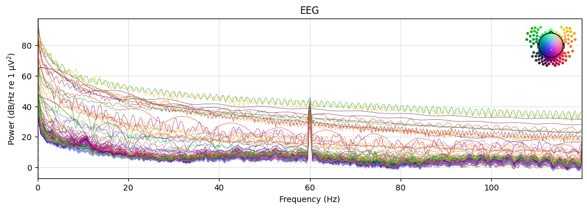
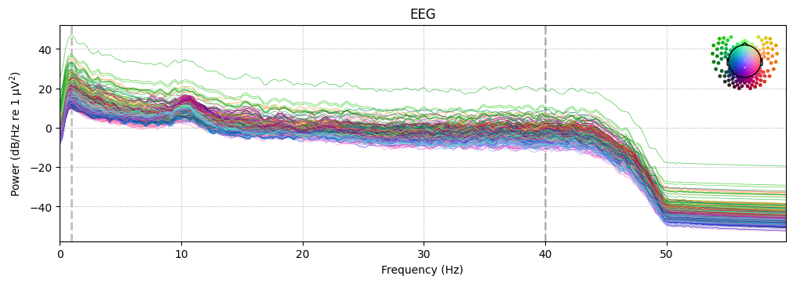

# Replicating-Shalamberidze-et-al.-2026-EEG-Pre-Processing-in-Python

This project is a translation of a 12-step MATLAB/EEGLAB pre-processing pipeline into **MNE-Python**. 

The workflow is based on the methodology used in the study: *Resting-State EEG and Trait Anxiety* (Shalamberidze et al., 2026).

## 📊 Scientific Validation

To verify the pipeline's success, the "Berger Effect" (Alpha Block) was analyzed at midline sensors **Fz (E21)** and **Pz (E101)**.

## ❯❯❯❯ Pre-processing results

To visualize the effectiveness of the 12-step pipeline, below is a comparison of the Power Spectral Density (PSD) before and after processing.

Raw Data:

Cleaned Data:

### 📈 Results Summary

- **Pz (Parietal)**: Observed a **+198.3% increase** in Alpha power during Eyes Closed vs. Eyes Open conditions, representing a clean neural physiological response.
- **Fz (Frontal)**: Observed a **+660.2% increase**, noted as highly sensitive to frontal artifacts (eye movements/EMG) common in resting-state protocols.

## 📂 Repository Structure
- `EEG_Analysis_Demo.ipynb`: The complete notebook containing 72 cells of code and documentation.
- `Pre-processing-pipeline.md`: 12-step pre-processing pipeline, as outlined in the original literature.
- `data/`: BIDS-compliant EEG dataset (OpenNeuro ds007609).

## 🧰 Tech Stack
- **MNE-Python**
- **PyBIDS**
- **NumPy**
- **Matplotlib**

---
*Developed as a proof-of-concept for transitioning neuro-computational workflows from MATLAB to Python.*